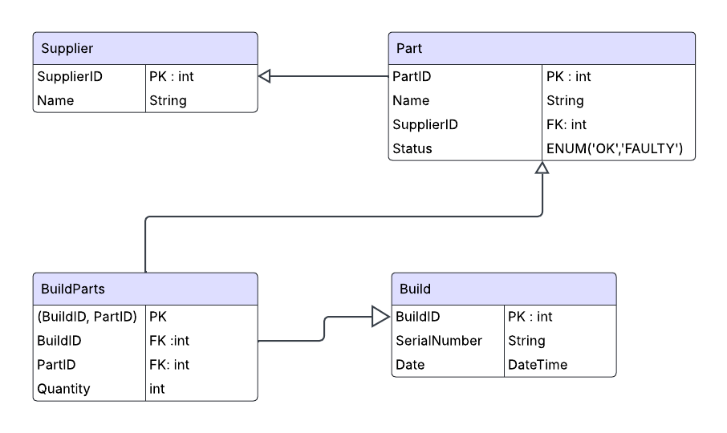

# LaunchTrace - SpaceX Parts Management System

A full-stack application for tracking rocket parts and builds, designed as a SpaceX interview preparation project.

## Architecture

```
┌─────────────────┐    ┌──────────────────┐    ┌─────────────────┐
│   Angular 17    │    │   .NET 8 Web API │    │   PostgreSQL    │
│   Frontend      │◄──►│   (Minimal API)  │◄──►│   Database      │
│   (Port 4200)   │    │   (Port 5029)    │    │   (Port 5432)   │
└─────────────────┘    └──────────────────┘    └─────────────────┘
        │                        │                        │
        │                        │                        │
   Angular Material         Entity Framework          Docker
   Standalone Components    Core + Npgsql             Container
```

## Tech Stack

- **Backend**: .NET 8 Web API with Minimal APIs
- **Database**: PostgreSQL with Entity Framework Core
- **Frontend**: Angular 17 Standalone Components with Angular Material
- **Containerization**: Docker & Docker Compose
- **CI/CD**: GitHub Actions

## Database Schema / ER Diagram


This database schema is implemented using Entity Framework Core with PostgreSQL,and seeded with file [`seed_data_int.sql`](seed_data_int.sql). It includes:

- **Suppliers**: 30 suppliers providing parts
- **Parts**: 1,500 parts with statuses (90% OK, 10% FAULTY)
- **Builds**: 200 rocket builds with random dates (last 365 days)

## Domain Models

- **Supplier**: Company providing parts
- **Part**: Individual components with status (OK/FAULTY)
- **Build**: Rocket assembly with serial number and date
- **BuildPart**: Many-to-many relationship between builds and parts

## Quick Start

### Prerequisites

- .NET 8 SDK
- Node.js 18+
- Docker & Docker Compose
- Angular CLI (`npm install -g @angular/cli`)

### Docker Compose

```bash
# Clone and navigate to project
git clone <repository-url>
cd LaunchTrace

# Start services (database + API)
docker-compose up -d

# The API will be available at http://localhost:5029
# Database will be seeded automatically with sample data
```

### Database Setup

If running locally, create the database and run migrations:

```bash
# Create and apply migrations
dotnet ef migrations add InitialCreate --project LaunchTrace
dotnet ef database update --project LaunchTrace

# Seed the database
docker exec -i postgres-launchtrace psql -U postgres -d launchtrace < seed_data_int.sql
```

## API Endpoints

### Parts Management

| Method | Endpoint                        | Description                             |
| ------ | ------------------------------- | --------------------------------------- |
| GET    | `/api/parts?skip={}&take={}`    | Get paginated parts list with suppliers |
| POST   | `/api/parts/{id}/flagFaulty`    | Mark part as faulty                     |
| GET    | `/api/impacted-builds/{partId}` | Get builds using a specific part        |

### Builds Management

| Method | Endpoint                      | Description                                     |
| ------ | ----------------------------- | ----------------------------------------------- |
| GET    | `/api/builds?skip={}&take={}` | Get paginated builds list with part counts      |
| GET    | `/api/builds/{id}`            | Get detailed build with all parts and suppliers |
| POST   | `/api/builds`                 | Create new build with part assignments          |

### Example API Responses

**GET /api/parts**

```json
{
  "total": 1500,
  "items": [
    {
      "partId": 1,
      "name": "Engine Nozzle",
      "status": "OK",
      "supplierId": 1,
      "supplier": {
        "supplierId": 1,
        "name": "Rocket Parts Inc"
      }
    }
  ]
}
```

**GET /api/builds**

```json
{
  "total": 202,
  "items": [
    {
      "buildId": 1,
      "serialNumber": "FALCON-001",
      "buildDate": "2024-12-15T10:30:00Z",
      "partCount": 8,
      "faultyPartCount": 1
    }
  ]
}
```

**POST /api/builds** (Request Body)

```json
{
  "serialNumber": "STARSHIP-042",
  "buildDate": "2024-12-20T14:00:00Z",
  "partIds": [1, 5, 10, 15, 22]
}
```

## Frontend Features

### Parts Management

- **Parts Table**: Paginated table with filtering (All/OK/FAULTY)
- **Flag Faulty**: Button to mark parts as defective
- **Impacted Builds**: View builds affected by specific parts
- **Supplier Information**: Display part suppliers in table

### Builds Management

- **Builds Table**: Paginated table showing all spacecraft builds
- **Build Details**: Detailed view with all parts and their statuses
- **Part Count Tracking**: Display total parts and faulty parts per build
- **Create Builds**: Interface to create new builds with part assignments

### UI/UX Features

- **Tabbed Navigation**: Switch between Parts and Builds management
- **Loading States**: Spinner during API calls
- **Responsive Design**: Material Design components
- **Status Indicators**: Visual indicators for part and build statuses

## Testing

```bash
# Run integration tests
dotnet test

# The tests use WebApplicationFactory to verify:
# Parts Management:
# 1. GET /api/parts returns paginated data with suppliers
# 2. POST /api/parts/{id}/flagFaulty toggles part status
#
# Builds Management:
# 3. GET /api/builds returns builds with part counts
# 4. GET /api/builds/{id} returns detailed build with parts
# 5. POST /api/builds creates new builds with part assignments
```

## Development Commands

```bash
# Backend
dotnet build                          # Build solution
dotnet run --project LaunchTrace     # Run API
dotnet test                          # Run tests

# Frontend
ng serve                             # Dev server
ng build                             # Production build
npm run test                         # Unit tests

# Docker
docker-compose up -d                 # Start all services
docker-compose down                  # Stop all services
docker-compose logs api              # View API logs
```

## File Structure

```
LaunchTrace/
├── LaunchTrace/                     # .NET Web API
│   ├── Models/                      # Domain models & DTOs
│   ├── Data/                        # DbContext
│   └── Program.cs                   # API endpoints
├── LaunchTrace.Tests/               # Integration tests
├── launchtrace-ui/                  # Angular frontend
│   ├── src/app/components/          # UI components
│   ├── src/app/services/            # HTTP services
│   └── src/app/models/              # TypeScript interfaces
├── docker-compose.yml               # Multi-container setup
├── Dockerfile                       # API container
├── seed_data_int.sql               # Database seed script
└── .github/workflows/ci.yml        # CI pipeline
```
